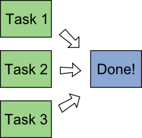
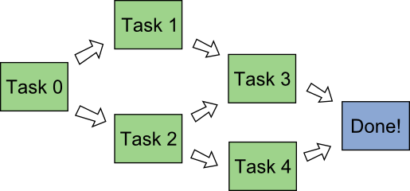
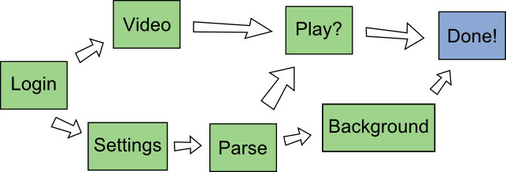

# promiseDAG

The `promiseDAG()` function makes it easier to work with JavaScript's promises.
It is a generalization of `Promise.all` to directed acyclic graphcs (DAG's).
The project is [hosted on GitHub](https://github.com/daanmichiels/promiseDAG).
You can see it in action on the <a href="demo/">demo page</a>.

This page tries to explain what the `promiseDAG()` function does.


## Promises in JavaScript

In JavaScript, promises are objects that represent the result of an asynchronous operation
that may or may not have completed.
If you are not familiar with promises, here are some good pages to read:

- [Web Fundamentals at Google Developers](https://developers.google.com/web/fundamentals/getting-started/primers/promises)
- [The Mozilla Developer Network](https://developer.mozilla.org/en-US/docs/Web/JavaScript/Reference/Global_Objects/Promise)

[Here](http://caniuse.com/#feat=promises) you'll find promises on caniuse.com
(note: `promiseDAG` uses arrow functions, which are currently [not supported as widely](http://caniuse.com/#feat=arrow-functions) as
promises are; in the future, `promiseDAG` will stop using arrow functions for wider support).


## Promise.prototype.then()

A promise's `then` method can be used for convenient chaining of promises.
If multiple asynchronous tasks need to be completed sequentially,
with the output of one being fed as input to the next, `Promise.prototype.then()` is ideal.

In the following snippet, three promises are chained (each just sleeps for a little while).

````JavaScript
// promise that resolves after t milliseconds
// with no value
function sleep(t) {
	return new Promise((resolve, reject) => {
		setTimeout(() => {
			console.log("resolved", t);
			resolve();
		}, t);
	});
}

sleep(3000)
.then((value) => { return sleep(2000); })
.then((value) => { return sleep(1000); })
.then((value) => { console.log("done!"); });
````

In other words, `Promise.prototype.then()` is suited for this kind of situation (time in the diagram goes from left to right):


## Promise.all()

The standard
[`Promise.all()`](https://developer.mozilla.org/en-US/docs/Web/JavaScript/Reference/Global_Objects/Promise/all)
in JavaScript constructs a promise from a list (well, iterable) of promises.
The constructed promise satisfies the following properties:

- it gets resolved when all supplied promises have been resolved,
- it gets rejected as soon as one of the supplied promises has been rejected.

In the following snippet, three promises are started at the same time.

````JavaScript
// promise that resolves after t milliseconds
// with no value
function sleep(t) {
	return new Promise((resolve, reject) => {
		setTimeout(() => {
			console.log("resolved", t);
			resolve();
		}, t);
	});
}

Promise.all([sleep(3000), sleep(2000), sleep(1000)])
.then((value) => { console.log("done!"); });
````

In other words, `Promise.all()` is suited for this kind of situation (all the tasks are started at the same time):




## promiseDAG()

The `promiseDAG()` function generalizes both chaining of promises (using `Promise.prototype.then()`) and simultaneous execution of promises (using `Promise.all()`).
It allows the efficient execution of a _network_ of tasks, or if you want, of a dependency graph of tasks.
In other words, `promiseDAG()` is suited for the above kinds of situations, but also for this one:



More precisely, the function `promiseDAG()` can be used to execute any _directed acyclic graph_
of asynchronous tasks (the `DAG` stands for directed acyclic graph).

Let's take the example network in the picture above.
The tasks are

- task 0 (no dependencies)
- task 1 (depends on task 0)
- task 2 (depends on task 0)
- task 3 (depends on task 1 and 2)
- task 4 (depends on task 2)

The snippet shows the code to run these tasks in the correct order, efficiently.

````JavaScript
// each of these should return a promise that executes the task
function task0() {
	return ...
}
function task1(value0) {
	return ...
}
function task2(value0) {
	return ...
}
function task3(value1, value2) {
	return ...
}
function task4(value2) {
	return ...
}

var p = promiseDAG([task0, task1, task2, task3, task4], [[], [0], [0], [1,2], [2]]);
````

When this code is run, the following happens:

- Task 0 is started.
- As soon as task 0 is done, task 1 is started (and gets the return value of task 0 as argument),
  and task 2 is started (also receiving the return value of task 0).
- As soon as task 2 is done, task 4 is started (receiving the value returned by task 2).
- As soon as task 2 and 1 are done, task 3 is started (receiving the value returned by task 1 and task 2).
- As soon as all the tasks are done, promise `p` is resolved. It returns as value a list
  containing the return values of each of the tasks, in order.
- If at any moment, any of the tasks get rejected, promise `p` gets rejected (and no new tasks
  are started after this).

### promiseDAG arguments and return value

The function `promiseDAG` takes two arguments.

- _tasks_: a list of functions that return promises
  (you could e.g. make them async functions)
- _dependencies_: a list of the same length as the first.
  The _n_'th element of this list is itself a list of integers,
  that specifies the dependencies of the _n_'th task
  as 0-based indices into _tasks_.

The function `promiseDAG` returns a promise.

- This promise is resolved as soon as each task has been executed and the corresponding
promise has been resolved. The value of the returned promise is then a list of the same
length as tasks, containing the returned values of all the resolved promises in order.
- This promise is rejected as soon as one of the promises of a task has been rejected.


### Order of execution

The `promiseDAG` function does not guarantee that the tasks are executed in any particular order,
just that the order in which they are executed is a _topological sorting_ of the dependency
graph given to it.

### Why not pass in promises directly?

The tasks that you want to execute asynchronously using `promiseDAG` need to be specified
as _functions that return promises_, not as promises. There is a very simple reason for this:
as soon as a promise is created, the asynchronous task has started (e.g. if you're using `fetch`
to get data in the background, the creation of the promise starts the fetching).
Since we need to have the dependencies of a tasks resolved before we can start it,
`promiseDAG` cannot accept promises as arguments (because it needs to be able to choose
when to start the task).

### Dependencies vs arguments

You'll note in the code above that task 3 has two dependencies (task 1 and task 2),
and that the function `task3` takes two arguments (`value1` and `value2`).
When task 1 and task 2 are finished, the function `task3` is called to start the 3rd task,
and it gets the return values of the promises of task 1 and task 2 as arguments.

In general, the promise-creating function will be called with one argument for each of its dependencies. Each argument is the value returned by the promise corresponding to this dependency.
Note that the order of the arguments is determined by the order in which the dependencies of
a task are specified.

If you want to specify something as a dependency, but don't need the corresponding value passed
as an argument, it is best to specify this as the last dependency (or the last couple, if there are multiple), and just pretend that the return value doesn't get passed to the function at all.
Technically, your function will get called with too many arguments, but JavaScript ignores this.


## Example

Suppose you're running a website with a video of the day.
When a user visits the site, the following things need to happen:

1. log in the user
2. fetch the user's settings
3. parse the user's settings into JSON
4. load the video of the day (which is only available to registered users)
5. change the page's background color according to the user's settings
6. play the video, if the user has auto-play enabled

The tasks and their interdependencies are illustrated here.



This snippet illustrates how to use `promiseDAG()` to get these asynchronous tasks
executed efficiently.
Note that the `async` keyword was used twice, in order to not have to construct
promises explicitly.

````JavaScript
function login() {
	return ... // a promise that resolves to the username on successful login
}

function fetchSettings(username) {
	return fetch('./settings/' + username, {method: 'get'});
}

// the argument received here is a Response from fetch
function parseSettings(settings) {
	return settings.json();
}

// ignore the username argument, since we don't need it
function loadVideo() {
	return new Promise((resolve, reject) => {
		var video = document.createElement("video");
		video.addEventListener("canplay", resolve(video)); // resolve when ready to play
		video.src = "video.mp4";
	});
}

// the argument received here is the settings as JSON
async function setBackground(settings) {
	document.body.style.background = settings.favoritecolor;
}

async function play(video, settings) {
	if(settings.autoplay) {
		video.play();
	}
}

promiseDAG([login,         // 0
            fetchSettings, // 1
            parseSettings, // 2
            loadVideo,     // 3
            setBackground, // 4
            play,          // 5
            ],
           [[],
            [0],
            [1],
            [0],
            [2],
            [3,2], // match order of arguments
            ]);

````
